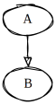

# Sketchviz

This repo is a command line clone of https://sketchviz.com/

**Main features:**
- produce a svg from a dot file
- use the latest version of GraphViz (and not Viz.js). This fixes tons of issues
- watch for file changes and update the svg automatically

## Installation

```bash
cd ~/bin
wget https://raw.githubusercontent.com/mittelmark/sketchviz/master/sketch.js
wget https://raw.githubusercontent.com/mittelmark/sketchviz/master/font.css
chmod 755 sketch.js
npm install roughjs
npm install jsdom
cd ~
echo "digraph g { A -> B }" > AB.dot
sketch.js AB.dot AB.svg
### checking the output
firefox AB.svg
```



